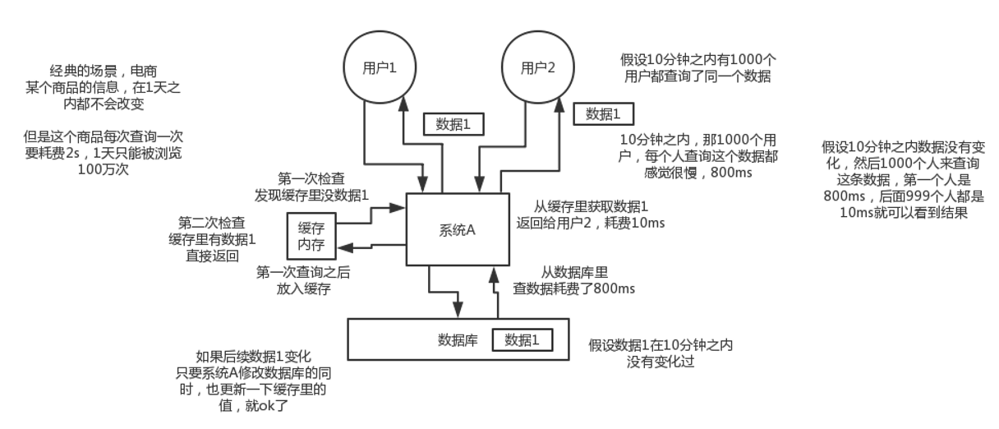
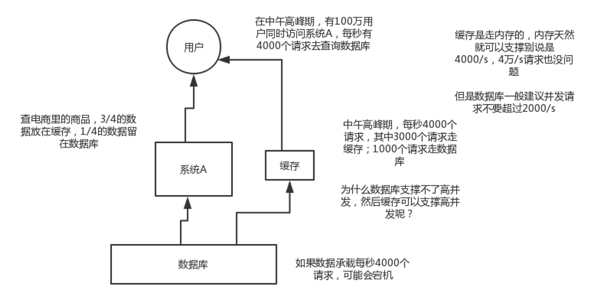

<h1 align="center">分布式缓存</h1>

## 面试题

在项目中缓存是如何使用的？缓存如果使用不当会造成什么后果？

***

## 为啥在项目里要用缓存呢？

用缓存，主要是俩用途：

- 高性能
- 高并发

### 高性能

假设这么个场景，你有个操作，一个请求过来，执行了N多条mysql语句，半天查出来一个结果，耗时600ms。但是这个结果可能接下来几个小时都不会变了，或者变了也可以不用立即反馈给用户。那么此时咋办？

- **缓存**。将查询600ms查出来的结果扔缓存里，一个key对应一个value，下次再有人查，不走mysql。直接从缓存里，通过一个key查出来一个value，2ms搞定。性能提升300倍。这就是所谓的**高性能**。
- 就是把你一些复杂操作耗时查出来的结果，如果确定后面不咋变了，然后但是马上还有很多读请求，那么直接结果放缓存，后面直接读缓存就好了。

***

### 高并发

mysql这么重的数据库，压根儿设计不是让你玩儿高并发的，虽然也可以玩儿，但是天然支持不好。mysql单机支撑到`2000qps`也开始容易报警了。

**缓存是如何实现高并发的**：

缓存是走内存的，内存天然就可以支撑别说是4000/s，4万/s请求也没问题。

**场景**

- 要是你有个系统，高峰期一秒钟过来的请求有1万，那一个mysql单机绝对会死掉。你这个时候就只能上缓存，把很多数据放缓存，别放mysql。缓存功能简单，说白了就是key-value式操作，单机支撑的并发量轻松一秒几万十几万，支撑高并发so easy。单机承载并发量是mysql单机的几十倍。
- 可以缓存结果的复杂查询场景，后续可以大幅度提升性能，优化用户体验。

**常见的缓存问题**

- 缓存与数据库双写不一致
- 缓存雪崩
- 缓存穿透
- 缓存并发竞争
